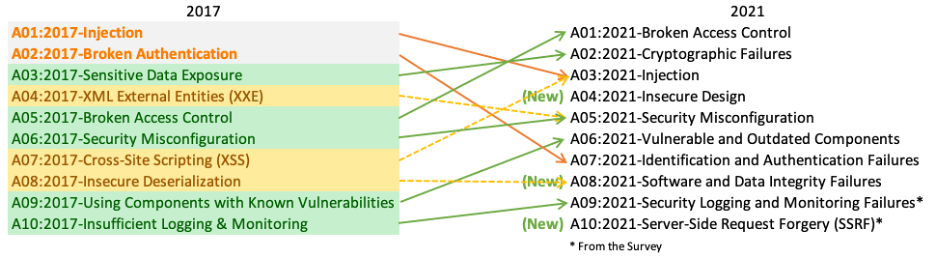

# OWASP TOP 10 com Python/Flask 

Este repositório tem como objetivo explicar e demonstrar os principais riscos de segurança, utilizando exemplos práticos em Python dentro de um contexto de uma aplicação Flask. As definições e referências foram baseadas na última versão de [OWASP TOP 10](https://owasp.org/Top10/) (2021).

## O que é OWASP
A Open Web Application Security Project (OWASP) é uma organização sem fins lucrativos focada em melhorar a segurança de software. A missão da OWASP é tornar a segurança visível, para que os indivíduos e organizações possam tomar decisões informadas sobre riscos de segurança de software.

## O que é OWASP TOP 10
O OWASP TOP 10 é uma lista de dez vulnerabilidades críticas de segurança em aplicações web, atualizada periodicamente pela comunidade OWASP. A atualização do OWASP Top 10 é um esforço colaborativo que conta com a contribuição de profissionais da área de segurança e desenvolvimento de software. A lista é baseada em dados coletados de testes de aplicações e pesquisas da comunidade sobre vulnerabilidades e ameaças emergentes.

## Conteúdo

1. [Broken Access Control](exemplos/A01-Broken%20Access%20Control/README.md)
2. [Cryptographic Failures](exemplos/A02-Cryptographic%20Failures/README.md)
3. [Injection](exemplos/A03-Injection/README.md)
4. [Insecure Design](exemplos/A04-Insecure%20Design/README.md)
5. [Security Misconfiguration](exemplos/A05-Security%20Misconfigurations/README.md)
6. [Vulnerable and Outdated Components](exemplos/A06-Vulnerable%20and%20Outdated%20Components/README.md)
7. [Identification and Authentication Failures](exemplos/A07-Identification%20and%20Authentication%20Failures/README.md)
8. [Software and Data Integrity Failures](exemplos/A08-Software%20and%20Data%20Integrity%20Failures/README.md)
9. [Security Logging and Monitoring Failures](exemplos/A09-Security%20Logging%20and%20Monitoring%20Failures/README.md)
10. [Server-Side Request Forgery (SSRF)](exemplos/A10-Server-Side%20Request%20Forgery/README.md)
